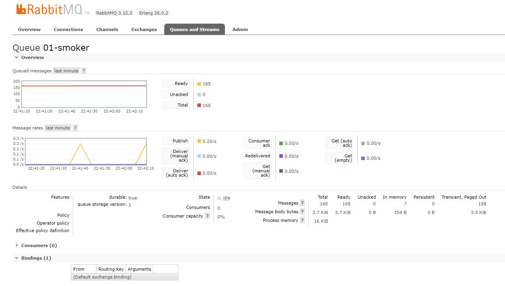

# streaming-06-smart-smoker
Continuation from module 5. Creating Consumer(s) for the producer. 

# streaming-05-smart-smoker

Ryan Smith - Module 5 Project Work - Smart Smoker Data

## Project Overview

For our project we will be creating a producer to send data that it receives from the smart smoker. The program will utilize three queues:
    Queue one will be for the smoker
    Queue two will be for Food A temp
    Queue three will be for Food B temp

The script will take the data from the .csv and make tuples for messages. It will use the date/time and the respective temperature. 
It will produce a message for each and send the message to the respective queue.
We can see and monitor the messages that are being sent in the RabitMQ Management. You can see several screen shots of examples below. 

## Module 6 Component

For part two in module 6 we created the consumer for the producer. It had three queues to listen to the producer. We were able to add alerts to send a message for temperature
changes. One for the smoker, and one for each of Food A and Food B. Screen shots added showing the consumer displaing the alerts from the temp changes. 

## Screenshots

The first image is the processor running in the VS Code environment.

The next several images will show the RabbitMQ admin web Management.

Images to show the alerts from the consumer as it reaches temp thresholds.

